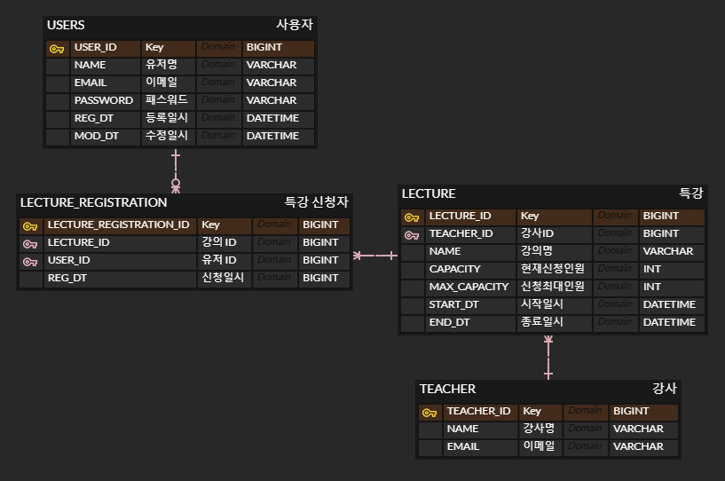

# 특강 신청 서비스


## ERD


### 사용자, 강사
- 강사 테이블에 저장된 사람만 특강을 할 수 있습니다.
	- 사용자는 `USER` 강사는 `TEACHER` 테이블로 분리하였습니다.

### 특강
- 간단한 설계를 위하여 특강은 회차의 구분이 별도로 없습니다. 회차로 구분하고자 할 경우 특강을 새로 생성하고 강의명(NAME)에 별도로 표기합니다.
- 1일 이상 진행되는 특강을 위해 시작일시, 종료일시(START_DT, END_DT)를 두었습니다.
- 특강을 신청할 수 있는 인원 수(MAX_CAPACITY)와 현재 특강을 신청한 인원 수(CAPACITY)를 저장합니다.

### 특강 신청 정보
- 한 사용자가 여러 특강을 신청(1:N), 특강 하나를 여러 사용자가 수강(1:N)할 수 있도록 LECTURE_ID, USER_ID를 FK로 두어 LECTURE_REGISTRATION 테이블을 설계했습니다.

## API Specifications
### 특강 신청
- 사용자 아이디, 특강 아이디(userId, lectureId)를 받아 특강을 신청한다.
- POST `/api/v1/lectures/register`
- REQUEST
```json
{
	"userId" : 1,
	"lectureId" : 1
}
```
- RESPONSE (200)
```json
{
    "code": 200,
    "message": "Success"
}
```

### 특강 신청 가능 목록
- 입력 받은 날짜(date) 기준으로 신청 가능한 특강을 조회한다.
- 신청 가능한 특강 기준
	- 입력 받은 날짜는 특강 시작일 이전이어야 한다.
	- 특강 신청할 수 있는 남은 인원 수가 존재해야 한다.
- GET `/api/v1/lectures/available?date=2024-12-26`
	- `date`는 yyyy-MM-dd 포맷
- RESPONSE (200)
```json
{
    "code": 200,
    "message": "Success",
    "data": [
        {
            "lectureId": 3,
            "lectureName": "플러스 토요일 특강 3주차",
            "teacherId": 1
            "teacherName": "PROF1",
            "teacherEmail": "prof1@gmail.com",
            "capacity": 0,
            "maxApplyCapacity": 30,
            "startDt": "2025-01-18T13:00:00",
            "endDt": "2025-01-18T18:00:00"
        },
        {
            "lectureId": 4,
            "lectureName": "플러스 토요일 특강 4주차",
            "teacherId": 1
            "teacherName": "PROF1",
            "teacherEmail": "prof1@gmail.com",
            "capacity": 20
            "maxApplyCapacity": 30,
            "startDt": "2025-01-25T13:00:00",
            "endDt": "2025-01-25T18:00:00"
        }
    ]
}
```
### 특강 신청 완료 목록 조회
- 입력 받은 사용자가 신청한 특강의 정보를 조회한다.
- GET `/api/v1/lectures/registrations?userId=2`
- RESPONSE (200)
```json
{
    "code": 200,
    "message": "Success",
    "data": [
        {
            "lectureId": 4,
            "lectureName": "플러스 토요일 특강 4주차",
            "teacherId": 1,
            "teacherName": "PROF1",
            "teacherEmail": "prof1@gmail.com",
            "capacity": 21,
            "maxCapacity": 30,
            "startDt": "2025-01-25T13:00:00",
            "endDt": "2025-01-25T18:00:00"
        }
    ]
}
```